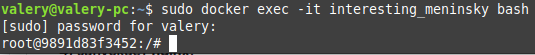

## Part 1. Готовый докер

- Устанавливаем докер по инструкции из источника [Install Docker Engine](https://docs.docker.com/engine/install/ubuntu/#installation-methods "install_docker")

- Возьмем официальный докер-образ с **nginx** и выкачаем его при помощи `docker pull`
  
  

- Проверяем наличие докер-образа через `docker images`
  
  

- Запускаем докер-образ через `docker run -d [image_id|repository]`
  
  

- Проверяем, что образ запустился через `docker ps`
  
  

- Просмотрим информацию о контейнере через `docker inspect [container_id|container_name]`
  
  
  
  ```bash
  [
      {
          "Id": "30f16b4cee962fd2f54966f4f47bf720877b3ba2d731d146b3b68f00f57f6bf8",
          "Created": "2024-08-20T06:14:00.157276493Z",
          "Path": "/docker-entrypoint.sh",
          "Args": [
              "nginx",
              "-g",
              "daemon off;"
          ],
          "State": {
              "Status": "running",
              "Running": true,
              "Paused": false,
              "Restarting": false,
              "OOMKilled": false,
              "Dead": false,
              "Pid": 8333,
              "ExitCode": 0,
              "Error": "",
              "StartedAt": "2024-08-20T06:14:00.317303368Z",
              "FinishedAt": "0001-01-01T00:00:00Z"
          },
          "Image": "sha256:5ef79149e0ec84a7a9f9284c3f91aa3c20608f8391f5445eabe92ef07dbda03c",
          "ResolvConfPath": "/var/lib/docker/containers/30f16b4cee962fd2f54966f4f47bf720877b3ba2d731d146b3b68f00f57f6bf8/resolv.conf",
          "HostnamePath": "/var/lib/docker/containers/30f16b4cee962fd2f54966f4f47bf720877b3ba2d731d146b3b68f00f57f6bf8/hostname",
          "HostsPath": "/var/lib/docker/containers/30f16b4cee962fd2f54966f4f47bf720877b3ba2d731d146b3b68f00f57f6bf8/hosts",
          "LogPath": "/var/lib/docker/containers/30f16b4cee962fd2f54966f4f47bf720877b3ba2d731d146b3b68f00f57f6bf8/30f16b4cee962fd2f54966f4f47bf720877b3ba2d731d146b3b68f00f57f6bf8-json.log",
          "Name": "/adoring_raman",
          "RestartCount": 0,
          "Driver": "overlay2",
          "Platform": "linux",
          "MountLabel": "",
          "ProcessLabel": "",
          "AppArmorProfile": "docker-default",
          "ExecIDs": null,
          "HostConfig": {
              "Binds": null,
              "ContainerIDFile": "",
              "LogConfig": {
                  "Type": "json-file",
                  "Config": {}
              },
              "NetworkMode": "bridge",
              "PortBindings": {},
              "RestartPolicy": {
                  "Name": "no",
                  "MaximumRetryCount": 0
              },
              "AutoRemove": false,
              "VolumeDriver": "",
              "VolumesFrom": null,
              "ConsoleSize": [
                  24,
                  80
              ],
              "CapAdd": null,
              "CapDrop": null,
              "CgroupnsMode": "private",
              "Dns": [],
              "DnsOptions": [],
              "DnsSearch": [],
              "ExtraHosts": null,
              "GroupAdd": null,
              "IpcMode": "private",
              "Cgroup": "",
              "Links": null,
              "OomScoreAdj": 0,
              "PidMode": "",
              "Privileged": false,
              "PublishAllPorts": false,
              "ReadonlyRootfs": false,
              "SecurityOpt": null,
              "UTSMode": "",
              "UsernsMode": "",
              "ShmSize": 67108864,
              "Runtime": "runc",
              "Isolation": "",
              "CpuShares": 0,
              "Memory": 0,
              "NanoCpus": 0,
              "CgroupParent": "",
              "BlkioWeight": 0,
              "BlkioWeightDevice": [],
              "BlkioDeviceReadBps": [],
              "BlkioDeviceWriteBps": [],
              "BlkioDeviceReadIOps": [],
              "BlkioDeviceWriteIOps": [],
              "CpuPeriod": 0,
              "CpuQuota": 0,
              "CpuRealtimePeriod": 0,
              "CpuRealtimeRuntime": 0,
              "CpusetCpus": "",
              "CpusetMems": "",
              "Devices": [],
              "DeviceCgroupRules": null,
              "DeviceRequests": null,
              "MemoryReservation": 0,
              "MemorySwap": 0,
              "MemorySwappiness": null,
              "OomKillDisable": null,
              "PidsLimit": null,
              "Ulimits": [],
              "CpuCount": 0,
              "CpuPercent": 0,
              "IOMaximumIOps": 0,
              "IOMaximumBandwidth": 0,
              "MaskedPaths": [
                  "/proc/asound",
                  "/proc/acpi",
                  "/proc/kcore",
                  "/proc/keys",
                  "/proc/latency_stats",
                  "/proc/timer_list",
                  "/proc/timer_stats",
                  "/proc/sched_debug",
                  "/proc/scsi",
                  "/sys/firmware",
                  "/sys/devices/virtual/powercap"
              ],
              "ReadonlyPaths": [
                  "/proc/bus",
                  "/proc/fs",
                  "/proc/irq",
                  "/proc/sys",
                  "/proc/sysrq-trigger"
              ]
          },
          "GraphDriver": {
              "Data": {
                  "LowerDir": "/var/lib/docker/overlay2/7ff9a51d413d4213aa3fb0955c02d9ba28a3bb94e45b747b02b25da624a389b0-init/diff:/var/lib/docker/overlay2/dfde4d125612a0b8798405035f5ffb16563c529ca71ccbb876b80bed65c5a425/diff:/var/lib/docker/overlay2/ac7083f712dc170c8e8066a82770c675378278c3fcaec0753c32e2452c4323f4/diff:/var/lib/docker/overlay2/b341ec7166aa92280739f6e1b67ae907449c67fa377782dfcbd8d5e83ea3c324/diff:/var/lib/docker/overlay2/041c4add5e570caea45721666a7e0ee8899257eee9b8286161112cd828d3cdee/diff:/var/lib/docker/overlay2/756f6e13a248c718ea3fb910845e94d69419ad46209e1823e48684cb87bc3ae3/diff:/var/lib/docker/overlay2/f0833325b637d77619e93a567bca37d2b1c224704319081c651d5c1c15855cc3/diff:/var/lib/docker/overlay2/3a209efb2d4da6760830ee6363a66788cb8fdcfdeac78746bbcafc4c8f743130/diff",
                  "MergedDir": "/var/lib/docker/overlay2/7ff9a51d413d4213aa3fb0955c02d9ba28a3bb94e45b747b02b25da624a389b0/merged",
                  "UpperDir": "/var/lib/docker/overlay2/7ff9a51d413d4213aa3fb0955c02d9ba28a3bb94e45b747b02b25da624a389b0/diff",
                  "WorkDir": "/var/lib/docker/overlay2/7ff9a51d413d4213aa3fb0955c02d9ba28a3bb94e45b747b02b25da624a389b0/work"
              },
              "Name": "overlay2"
          },
          "Mounts": [],
          "Config": {
              "Hostname": "30f16b4cee96",
              "Domainname": "",
              "User": "",
              "AttachStdin": false,
              "AttachStdout": false,
              "AttachStderr": false,
              "ExposedPorts": {
                  "80/tcp": {}
              },
              "Tty": false,
              "OpenStdin": false,
              "StdinOnce": false,
              "Env": [
                  "PATH=/usr/local/sbin:/usr/local/bin:/usr/sbin:/usr/bin:/sbin:/bin",
                  "NGINX_VERSION=1.27.1",
                  "NJS_VERSION=0.8.5",
                  "NJS_RELEASE=1~bookworm",
                  "PKG_RELEASE=1~bookworm",
                  "DYNPKG_RELEASE=2~bookworm"
              ],
              "Cmd": [
                  "nginx",
                  "-g",
                  "daemon off;"
              ],
              "Image": "nginx",
              "Volumes": null,
              "WorkingDir": "",
              "Entrypoint": [
                  "/docker-entrypoint.sh"
              ],
              "OnBuild": null,
              "Labels": {
                  "maintainer": "NGINX Docker Maintainers <docker-maint@nginx.com>"
              },
              "StopSignal": "SIGQUIT"
          },
          "NetworkSettings": {
              "Bridge": "",
              "SandboxID": "19df904367996609238d982befd9bb846f321efe8dce515c69390844fefce619",
              "SandboxKey": "/var/run/docker/netns/19df90436799",
              "Ports": {
                  "80/tcp": null
              },
              "HairpinMode": false,
              "LinkLocalIPv6Address": "",
              "LinkLocalIPv6PrefixLen": 0,
              "SecondaryIPAddresses": null,
              "SecondaryIPv6Addresses": null,
              "EndpointID": "b414be0382c188a91c1961bd68301785eb1633db812d026426da9ff1addee338",
              "Gateway": "172.17.0.1",
              "GlobalIPv6Address": "",
              "GlobalIPv6PrefixLen": 0,
              "IPAddress": "172.17.0.2",
              "IPPrefixLen": 16,
              "IPv6Gateway": "",
              "MacAddress": "02:42:ac:11:00:02",
              "Networks": {
                  "bridge": {
                      "IPAMConfig": null,
                      "Links": null,
                      "Aliases": null,
                      "MacAddress": "02:42:ac:11:00:02",
                      "DriverOpts": null,
                      "NetworkID": "3ad45b115f1fdd40ced6f54b7bd5f6f5851522958571baef8be1303db39d4000",
                      "EndpointID": "b414be0382c188a91c1961bd68301785eb1633db812d026426da9ff1addee338",
                      "Gateway": "172.17.0.1",
                      "IPAddress": "172.17.0.2",
                      "IPPrefixLen": 16,
                      "IPv6Gateway": "",
                      "GlobalIPv6Address": "",
                      "GlobalIPv6PrefixLen": 0,
                      "DNSNames": null
                  }
              }
          }
      }
  ]
  ```

- По выводу команды определим размер контейнера, список замапленных портов и ip контейнера
  
  - размер контейнера
    
    
  
  - замаппенные порты
    
    
  
  - ip контейнера
    
    

- Остановим докер контейнер через `docker stop [container_id|container_name]`
  
  

- Проверяем, что контейнер остановился через `docker ps`
  
  

- Запустим докер с портами 80 и 443 в контейнере, замапленными на такие же порты на локальной машине, через команду *run*
  
  

- Проверяем, что в браузере по адресу *localhost:80* доступна стартовая страница **nginx**
  
  

- Перезапусти докер контейнер через `docker restart [container_id|container_name]` и проверяем, что контейнер запустился
  
  

## Part 2. Операции с контейнером

- Прочитаем конфигурационный файл *nginx.conf* внутри докер контейнера через команду *exec*
  
  

- Создаем на локальной машине файл *nginx.conf* и настраиваем в нем по пути */status* отдачу страницы статуса сервера **nginx**
  
  
  
  

- Скопируем созданный файл *nginx.conf* внутрь докер-образа через команду `docker cp`
  
  

- Перезапустим **nginx** внутри докер-образа через команду *exec*
  
  

- Проверим, что по адресу *localhost:80/status* отдается страничка со статусом сервера **nginx**
  
  

- Экспортируем контейнер в файл *container.tar* через команду *export*
  
  

- Остановим контейнер
  
  

- Удаляем образ через `docker rmi [image_id|repository]`, не удаляя перед этим контейнеры
  
  

- Удаляем остановленный контейнер
  
  

- Импортируем контейнер обратно через команду *import*
  
  
  
  

- Запустим импортированный контейнер
  
  

- Проверим, что по адресу *localhost:80/status* отдается страничка со статусом сервера **nginx**
  
  

## Part 3. Мини веб-сервер

- Напишем мини-сервер на **C** и **FastCgi**, который будет возвращать простейшую страничку с надписью `Hello World!`
  
  

- Напишем свой *nginx.conf*, который будет проксировать все запросы с 81 порта на *127.0.0.1:8080*
  
  

- Запустим написанный мини-сервер через *spawn-fcgi* на порту 8080
  
  - сначала установим новый docker образ
    
    
  
  - Копируем файлы в докер, предварительно создав папку сервер для си файла
    
    
    
    
  
  - запускаем контейнер и устанавливаем необходимые библиотеки установим необходимые библиотеки для работы с **FastCgi**
    
    
    
    ```bash
    apt-get update
    apt install gcc
    apt-get install libfcgi-dev
    apt-get install spawn-fcgi
    ```
  
  - скомпилируем код
    
    
  
  - запускаем сервер
    
    
  
  - скопируем написанный файл *nginx.conf* внутрь докер-образа через команду `docker cp`
    
    
  
  - перезапустим **nginx** внутри докер-образа через команду *exec*
    
    

- Проверяем, что в браузере по *localhost:81* отдается написанная страничка
  
  

- Положим файл *nginx.conf* по пути *./nginx/nginx.conf* (это понадобится позже)
  
  

## Part 4. Свой докер

- Напишем свой докер-образ, который:
  
  - собирает исходники мини сервера на FastCgi из Части 3;
  
  - запускает его на 8080 порту;
  
  - копирует внутрь образа написанный *./nginx/nginx.conf*;
  
  - запускает **nginx**.

- Создаем структуры каталогов и файлов
  
  

- Создаем свой образ Docker на основе nginx 
  
  

- Создаем баш скрипт который будет компилировать на сервер
  
  

- Собираем написанный докер-образ через `docker build` при этом указав имя и тег
  
  

- Проверяем через `docker images`, что все собралось корректно
  
  

- Запустим собранный докер-образ с маппингом 81 порта на 80 на локальной машине и маппингом папки *./nginx* внутрь контейнера по адресу, где лежат конфигурационные файлы **nginx**'а
  
  

- Проверяем, что по localhost:80 доступна страничка написанного мини сервера
  
  

- Допишем в *./nginx/nginx.conf* проксирование странички */status*, по которой надо отдавать статус сервера **nginx**
  
  

- Перезапустим докер-образ
  
  

- Проверим, что теперь по *localhost:80/status* отдается страничка со статусом **nginx**
  
  

## Part 5. **Dockle**

- Просканируем образ из предыдущего задания через `dockle [image_id|repository]`
  
  

- Исправляем образ так, чтобы при проверке через **dockle** не было ошибок и предупреждений
  
  
  
  *Исправленный Dockerfile*
  
  
  
  *Проверка с помощью dockle*

## Part 6. Базовый **Docker Compose**

- Устанавливаем docker compose по инструкции из источника [Install the Compose plugin](https://docs.docker.com/compose/install/linux/)

- Напишем файл docker-compose.yml, с помощью которого:
  
  - Поднимем докер-контейнер из Части 5 (он должен работать в локальной сети, т. е. не нужно использовать инструкцию EXPOSE и мапить порты на локальную машину)
  
  - Поднимем докер-контейнер с nginx, который будет проксировать все запросы с 8080 порта на 81 порт первого контейнера

- Замапим 8080 порт второго контейнера на 80 порт локальной машины
  
  
  
  

- Останови все запущенные контейнеры `docker stop [name]`
  
  

- Соберем и запустим проект с помощью команд docker-compose build и docker-compose up
  
  
  
  *docker compose build*
  
  
  
  *docker compose up*

- Проверим, что в браузере по localhost:80 отдается написанная страничка, как и ранее
  
  
